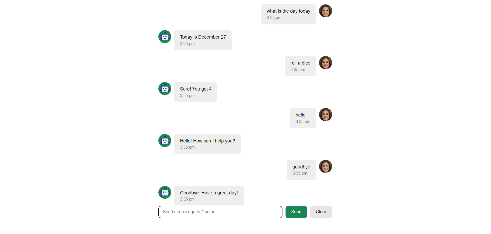

# 🤖 Chatbot Application – React Project

> A React-based chatbot application built while following the **“React Tutorial Full Course – Beginner to Pro (React 19, 2025)”** by SuperSimpleDev, focusing on React fundamentals, state management, local storage, and user experience features.

>
---

# Commands you can use in the chat
1. Goodbye
2. Roll a dice
3. Hello
4. Thanks
5. What is the date today
6. Flip a coin
7. How are you

## 👀 Why This Project Stands Out

- Built using **React** following a comprehensive, real-world tutorial  
- Demonstrates strong understanding of **React state, props, and components**  
- Uses **localStorage** to persist chat history across page reloads  
- Includes user-friendly features like **auto-scroll** and timestamps  
- Shows ability to work with **external APIs / servers** and predefined data  

---

## 🛠️ Tech Stack

- **React (React 19)** – Component-based UI and state management  
- **JavaScript (ES6+)** – Application logic and data handling  
- **HTML5** – Semantic markup  
- **CSS3** – Styling and layout  
- **Local Storage API** – Persistent chat history  
- **SuperSimpleDev Chat Server** – Predefined responses and data structures  

---

## ✨ Features

- Chatbot generates responses based on user input  
- Matches user input against predefined values from the SuperSimpleDev server  
- Returns a **generic response** when no match is found  
- Displays the **current time** for each sent message  
- Stores chat history in **local storage**  
- Chat history persists after page refresh  
- “Clear” button removes all stored chat history  
- **Auto-scroll to bottom** when a new message is sent  

---

## 🧠 What I Learned

- Core **React fundamentals** (components, props, state)  
- Managing dynamic UI updates in a chat-based interface  
- Working with **localStorage** for persistent application state  
- Integrating and consuming **external data sources**  
- Implementing **auto-scroll behavior** for better UX  
- Structuring a React project for clarity and scalability  

> 📌 This project was built by following a step-by-step YouTube tutorial by SuperSimpleDev. Recreating the chatbot helped me deeply understand how React handles state, user input, and real-time UI updates.

---

🔮 Future Improvements
Add support for dynamic API-based responses
Improve NLP matching for user input
Add typing indicators and animations
Support multiple chat sessions
Enhance UI styling and accessibility

🙋‍♂️ Author
Dennis Rumanek

GitHub: https://github.com/frontendhighroller

LinkedIn: https://www.linkedin.com/in/dennis-rumanek

⭐ If you find this project interesting, feel free to star the repository!
